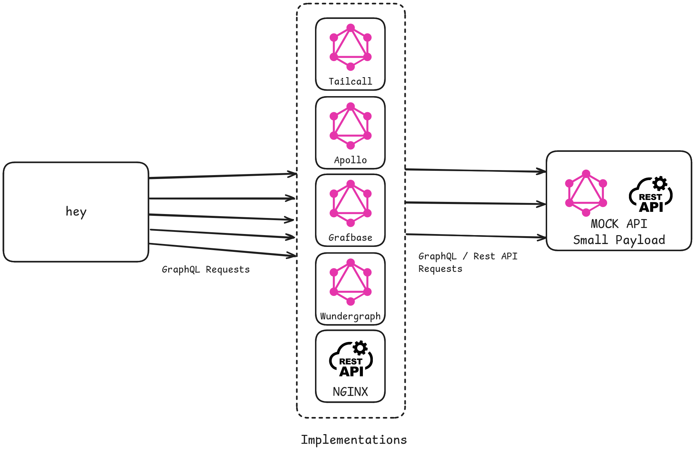

# Federation Benchmarks

Explore and compare the performance of the fastest GraphQL federation routers through our comprehensive benchmarks.

- [Benchmark Results](#benchmark-results)
- [Introduction](#introduction)
- [Architecture](#architecture)
- [Quick Start](#quick-start)
- [Resources](#resources)
- [Contribute](#contribute)

## Benchmark Results

<!-- PERFORMANCE_RESULTS_START -->
| Server | Status | RPS | Latency |
| ---: | ---: | ---: | ---: |
| [Nginx](https://nginx.org/en/) | ✅ | `5,326 RPS` | `0.0172 sec` |
| **Base** | | | |
| [Tailcall](https://github.com/tailcallhq/tailcall) | ✅ | `3,256 RPS` | `0.0224 sec` |
| [Grafbase](https://github.com/grafbase/grafbase) | ✅ | `3,798 RPS` | `0.0196 sec` |
| [Wundegraph](https://github.com/wundergraph/cosmo) | ✅ | `2,130 RPS` | `0.0548 sec` |
| [Apollo](https://github.com/apollographql/router) | ✅ | `2,051 RPS` | `0.0372 sec` |
| **Cached** | | | |
| [Tailcall](https://github.com/tailcallhq/tailcall) | ✅ | `16,697 RPS` | `0.0047 sec` |
| [Grafbase](https://github.com/grafbase/grafbase) | ✅ | `4,579 RPS` | `0.019 sec` |
| [Wundegraph](https://github.com/wundergraph/cosmo) | ✅ | `2,920 RPS` | `0.0407 sec` |
<!-- PERFORMANCE_RESULTS_END -->

## Introduction

This document presents a comparative analysis of several renowned GraphQL Federation routers. Dive deep into the performance metrics and get insights regarding their throughput and latency.

> **NOTE:** This is a work-in-progress suite of benchmarks, and we would appreciate help from the community to add more routers or tune the existing ones for better performance.

## Architecture

| Big Payload | Medium Payload | Small Payload |
| --- | --- | --- |
|  |  |  |

### Components

* `hey`: We use `hey` cli benchmarking tool to cause synthetic load to benchmark the different router `implementations`. We benchmark for '10 seconds` using `200 connections`. We constructed three different request payload configurations: [big](./scripts/bench-hey-big.json), [medium](./scripts/bench-hey-medium.json), [small](./scripts/bench-hey-small.json). Each configuration queries a response of payload size of [112,838 bytes](./source/big.json), [12598 bytes](./source/medium.json), and [362 bytes](./source/small.json) respectively.
* `Implementations`: We use a collection of different federation implementations, and for each of them, we also have different configuration setups located in the [configurations folder](./configurations/). We benchmark each implementation with varying configurations for every data configuration setup (big, medium, small). Most federation router `implementations` make GraphQL requests to the `Mock API` except `Tailcall`, which follows a different approach, enabling regular `Rest API` calls.
* `Mock API`: This component provides data to the `implementations`. It mocks a GraphQL subgraph and a Rest API. This component is written in Rust and serves static data. We do that to eliminate any overheads caused by processing the request in a real GraphQL subgraph.

## Quick Start

To run the benchmarks, you have to install Docker on your computer. We advise using Docker because it eliminates the hassle of managing benchmark dependencies. Follow the instructions provided on the official website: https://docs.docker.com/engine/install/

```bash
git clone git@github.com:tailcallhq/federation-example.git
cd federation-example
sudo docker build -t tailcallhq/federation-benchmark .
sudo Docker run tailcallhq/federation-benchmark:latest ./benchmark_all.sh
```

## Resources

* [Docker](https://www.docker.com/): Docker is a set of platform-as-a-service products that use OS-level virtualization to deliver software in packages called containers.
* [Hey](https://github.com/rakyll/hey): hey is a tiny program that sends some load to a web application.
* [Rust](https://www.rust-lang.org/): Rust is a general-purpose programming language emphasizing performance, type safety, and concurrency. It enforces memory safety, meaning that all references point to valid memory.
* [GraphQL Federation](https://graphql.com/learn/federated-architecture/): GraphQL Federation is an architecture that allows multiple independent GraphQL services to form a unified graph that appears as a single graph to clients. It is a powerful way to scale and manage microservices architecture when using GraphQL.

## Contribute

Your insights are invaluable! Test these benchmarks, share feedback, or contribute by adding more GraphQL frameworks or refining existing ones. Please open an issue or a pull request, and let's build a robust benchmarking resource together!
