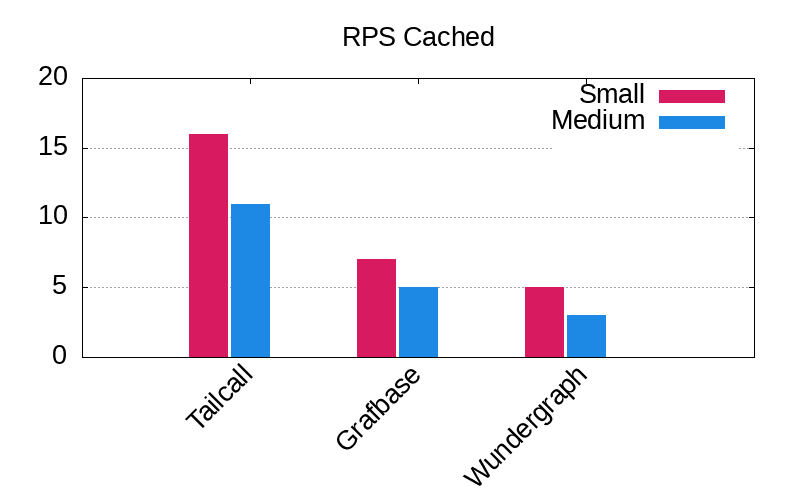
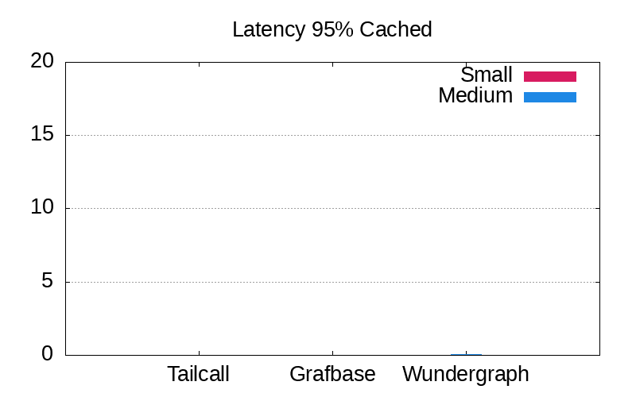
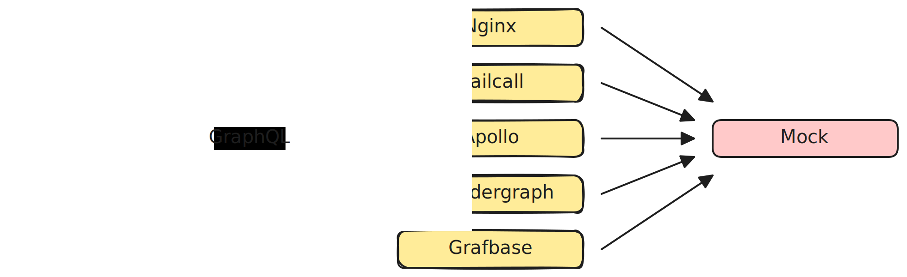

# GraphQL Federation Benchmarks

Explore and compare the performance of the fastest GraphQL federation routers through our comprehensive benchmarks.

- [GraphQL Federation Benchmarks](#graphql-federation-benchmarks)
  - [Benchmark Results](#benchmark-results)
    - [Small Payload - 362 bytes](#small-payload---362-bytes)
    - [Medium Payload - 12,598 bytes](#medium-payload---12598-bytes)
    - [Big Payload - 112,838 bytes](#big-payload---112838-bytes)
  - [Architecture](#architecture)
    - [Components](#components)
  - [Quick Start](#quick-start)
  - [Resources](#resources)

## Benchmark Results

<!-- PERFORMANCE_RESULTS_START -->
### [Small Payload - 362 bytes](./source/small.json)
| Server | Status | RPS | Latency |
| ---: | ---: | ---: | ---: |
| [Nginx](https://nginx.org/en/) | ✅ | `4,878 RPS` | `0.0225 sec` |
| **Base** | | | |
| [Tailcall](https://github.com/tailcallhq/tailcall) | ✅ | `7,882 RPS` | `0.0125 sec` |
| [Grafbase](https://github.com/grafbase/grafbase) | ✅ | `4,931 RPS` | `0.0148 sec` |
| [Wundegraph](https://github.com/wundergraph/cosmo) | ✅ | `3,207 RPS` | `0.0269 sec` |
| [Apollo](https://github.com/apollographql/router) | ✅ | `1,953 RPS` | `0.0428 sec` |
| **Cached** | | | |
| [Tailcall](https://github.com/tailcallhq/tailcall) | ✅ | `17,977 RPS` | `0.0086 sec` |
| [Grafbase](https://github.com/grafbase/grafbase) | ✅ | `6,852 RPS` | `0.014 sec` |
| [Wundegraph](https://github.com/wundergraph/cosmo) | ✅ | `5,491 RPS` | `0.0228 sec` |
### [Medium Payload - 12,598 bytes](./source/medium.json)
| Server | Status | RPS | Latency |
| ---: | ---: | ---: | ---: |
| [Nginx](https://nginx.org/en/) | ✅ | `4,537 RPS` | `0.0281 sec` |
| **Base** | | | |
| [Tailcall](https://github.com/tailcallhq/tailcall) | ✅ | `4,606 RPS` | `0.0173 sec` |
| [Grafbase](https://github.com/grafbase/grafbase) | ✅ | `3,645 RPS` | `0.0236 sec` |
| [Wundegraph](https://github.com/wundergraph/cosmo) | ✅ | `1,447 RPS` | `0.0721 sec` |
| [Apollo](https://github.com/apollographql/router) | ✅ | `2,098 RPS` | `0.0392 sec` |
| **Cached** | | | |
| [Tailcall](https://github.com/tailcallhq/tailcall) | ✅ | `13,212 RPS` | `0.0072 sec` |
| [Grafbase](https://github.com/grafbase/grafbase) | ✅ | `5,198 RPS` | `0.0171 sec` |
| [Wundegraph](https://github.com/wundergraph/cosmo) | ✅ | `3,355 RPS` | `0.0341 sec` |
### [Big Payload - 112,838 bytes](./source/big.json)
| Server | Status | RPS | Latency |
| ---: | ---: | ---: | ---: |
| [Nginx](https://nginx.org/en/) | ✅ | `2,020 RPS` | `0.0445 sec` |
| **Base** | | | |
| [Tailcall](https://github.com/tailcallhq/tailcall) | ✅ | `1,550 RPS` | `0.0489 sec` |
| [Grafbase](https://github.com/grafbase/grafbase) | ✅ | `1,787 RPS` | `0.0506 sec` |
| [Wundegraph](https://github.com/wundergraph/cosmo) | ✅ | `1,013 RPS` | `0.0941 sec` |
| [Apollo](https://github.com/apollographql/router) | ✅ | `1,240 RPS` | `0.0567 sec` |
| **Cached** | | | |
| [Tailcall](https://github.com/tailcallhq/tailcall) | ✅ | `6,998 RPS` | `0.0138 sec` |
| [Grafbase](https://github.com/grafbase/grafbase) | ✅ | `2,121 RPS` | `0.0408 sec` |
| [Wundegraph](https://github.com/wundergraph/cosmo) | ✅ | `1,594 RPS` | `0.0681 sec` |
<!-- PERFORMANCE_RESULTS_END -->

### RPS Plots




### Latency 95%




Specifications of the machine used for benchmarking:

```
Platform: Linux x64
Size:
2-cores · 8 GB RAM · 75 GB SSD
```

## Architecture



### Components

1. `hey`: We use `hey` cli benchmarking tool to cause synthetic load to benchmark the different router `implementations`. We benchmark for '10 seconds`using`200 connections`. We constructed three different request payload configurations: [big](./scripts/bench-hey-big.json), [medium](./scripts/bench-hey-medium.json), [small](./scripts/bench-hey-small.json). Each configuration queries a response of payload size of [112,838 bytes](./source/big.json), [12598 bytes](./source/medium.json), and [362 bytes](./source/small.json) respectively.
2. `Implementations`: We use a collection of different federation implementations, and for each of them, we also have different configuration setups located in the [configurations folder](./configurations/). We benchmark each implementation with varying configurations for every data configuration setup (big, medium, small).
3. `Mock`: This component provides data to the `implementations`. It mocks a GraphQL subgraph and an equivalent Rest API. This component is written in Rust and serves static data. We do that to eliminate any overheads caused by processing the request in a real GraphQL subgraph.

## Quick Start

To run the benchmarks, you have to install Docker on your computer. We advise using Docker because it eliminates the hassle of managing benchmark dependencies. Follow the instructions provided on the official website: https://docs.docker.com/engine/install/

```bash
git clone git@github.com:tailcallhq/federation-example.git
cd federation-example
sudo docker build -t tailcallhq/federation-benchmark .
sudo Docker run tailcallhq/federation-benchmark:latest ./benchmark_all.sh
```

## Resources

- [Docker](https://www.docker.com/): Docker is a set of platform-as-a-service products that use OS-level virtualization to deliver software in packages called containers.
- [Hey](https://github.com/rakyll/hey): hey is a tiny program that sends some load to a web application.
- [Rust](https://www.rust-lang.org/): Rust is a general-purpose programming language emphasizing performance, type safety, and concurrency. It enforces memory safety, meaning that all references point to valid memory.
- [GraphQL Federation](https://graphql.com/learn/federated-architecture/): GraphQL Federation is an architecture that allows multiple independent GraphQL services to form a unified graph that appears as a single graph to clients. It is a powerful way to scale and manage microservices architecture when using GraphQL.
