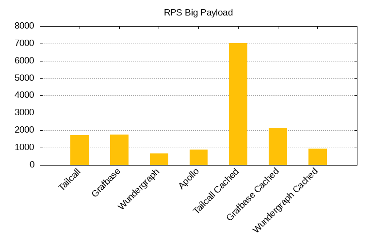
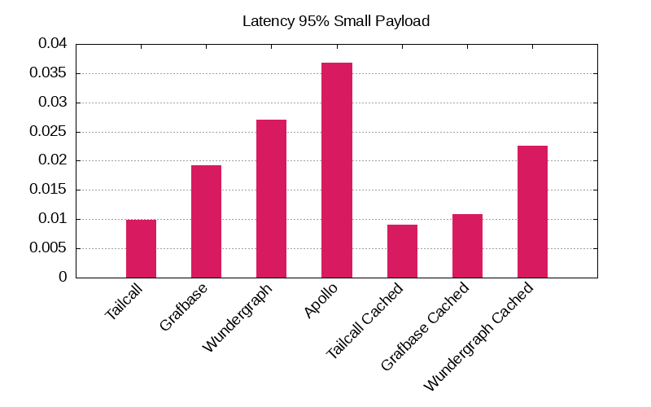

# GraphQL Federation Benchmarks

Explore and compare the performance of the fastest GraphQL federation routers through our comprehensive benchmarks.

- [GraphQL Federation Benchmarks](#graphql-federation-benchmarks)
  - [Benchmark Results](#benchmark-results)
    - [Small Payload - 362 bytes](#small-payload---362-bytes)
    - [Medium Payload - 12,598 bytes](#medium-payload---12598-bytes)
    - [Big Payload - 112,838 bytes](#big-payload---112838-bytes)
    - [RPS Plots](#rps-plots)
    - [Latency 95% Plots](#latency-95-plots)
  - [Architecture](#architecture)
    - [Components](#components)
  - [Quick Start](#quick-start)
  - [Resources](#resources)

## Benchmark Results

<!-- PERFORMANCE_RESULTS_START -->
### [Small Payload - 362 bytes](./source/small.json)
| Server | Status | RPS | Latency |
| ---: | ---: | ---: | ---: |
| [Nginx](https://nginx.org/en/) | ✅ | `4,950 RPS` | `0.0249 sec` |
| **Base** | | | |
| [Tailcall](https://github.com/tailcallhq/tailcall) | ✅ | `8,335 RPS` | `0.0101 sec` |
| [Grafbase](https://github.com/grafbase/grafbase) | ✅ | `5,039 RPS` | `0.0135 sec` |
| [Wundegraph](https://github.com/wundergraph/cosmo) | ✅ | `3,076 RPS` | `0.0275 sec` |
| [Apollo](https://github.com/apollographql/router) | ✅ | `2,489 RPS` | `0.0281 sec` |
| **Cached** | | | |
| [Tailcall](https://github.com/tailcallhq/tailcall) | ✅ | `17,780 RPS` | `0.0098 sec` |
| [Grafbase](https://github.com/grafbase/grafbase) | ✅ | `7,722 RPS` | `0.0105 sec` |
| [Wundegraph](https://github.com/wundergraph/cosmo) | ✅ | `4,754 RPS` | `0.0266 sec` |
### [Medium Payload - 12,598 bytes](./source/medium.json)
| Server | Status | RPS | Latency |
| ---: | ---: | ---: | ---: |
| [Nginx](https://nginx.org/en/) | ✅ | `4,829 RPS` | `0.0128 sec` |
| **Base** | | | |
| [Tailcall](https://github.com/tailcallhq/tailcall) | ✅ | `5,074 RPS` | `0.0137 sec` |
| [Grafbase](https://github.com/grafbase/grafbase) | ✅ | `3,545 RPS` | `0.0244 sec` |
| [Wundegraph](https://github.com/wundergraph/cosmo) | ✅ | `1,374 RPS` | `0.0735 sec` |
| [Apollo](https://github.com/apollographql/router) | ✅ | `1,610 RPS` | `0.0516 sec` |
| **Cached** | | | |
| [Tailcall](https://github.com/tailcallhq/tailcall) | ✅ | `11,500 RPS` | `0.0092 sec` |
| [Grafbase](https://github.com/grafbase/grafbase) | ✅ | `5,106 RPS` | `0.0184 sec` |
| [Wundegraph](https://github.com/wundergraph/cosmo) | ✅ | `2,483 RPS` | `0.0499 sec` |
### [Big Payload - 112,838 bytes](./source/big.json)
| Server | Status | RPS | Latency |
| ---: | ---: | ---: | ---: |
| [Nginx](https://nginx.org/en/) | ✅ | `2,055 RPS` | `0.0401 sec` |
| **Base** | | | |
| [Tailcall](https://github.com/tailcallhq/tailcall) | ✅ | `1,818 RPS` | `0.0371 sec` |
| [Grafbase](https://github.com/grafbase/grafbase) | ✅ | `2,024 RPS` | `0.0331 sec` |
| [Wundegraph](https://github.com/wundergraph/cosmo) | ✅ | `688 RPS` | `0.1456 sec` |
| [Apollo](https://github.com/apollographql/router) | ✅ | `1,052 RPS` | `0.084 sec` |
| **Cached** | | | |
| [Tailcall](https://github.com/tailcallhq/tailcall) | ✅ | `6,881 RPS` | `0.0132 sec` |
| [Grafbase](https://github.com/grafbase/grafbase) | ✅ | `2,194 RPS` | `0.0394 sec` |
| [Wundegraph](https://github.com/wundergraph/cosmo) | ✅ | `1,052 RPS` | `0.1021 sec` |
<!-- PERFORMANCE_RESULTS_END -->

### RPS Plots




### Latency 95% Plots




## Architecture


### Components

1. `hey`: We use `hey` cli benchmarking tool to cause synthetic load to benchmark the different router `implementations`. We benchmark for '10 seconds`using`200 connections`. We constructed three different request payload configurations: [big](./scripts/bench-hey-big.json), [medium](./scripts/bench-hey-medium.json), [small](./scripts/bench-hey-small.json). Each configuration queries a response of payload size of [112,838 bytes](./source/big.json), [12598 bytes](./source/medium.json), and [362 bytes](./source/small.json) respectively.
2. `Implementations`: We use a collection of different federation implementations, and for each of them, we also have different configuration setups located in the [configurations folder](./configurations/). We benchmark each implementation with varying configurations for every data configuration setup (big, medium, small).
3. `Mock`: This component provides data to the `implementations`. It mocks a GraphQL subgraph and an equivalent Rest API. This component is written in Rust and serves static data. We do that to eliminate any overheads caused by processing the request in a real GraphQL subgraph.

### Specifications

Specifications of the machine used for benchmarking:

```
Platform: Linux x64
Size:
2-cores · 8 GB RAM · 75 GB SSD
```

## Quick Start

To run the benchmarks, you have to install Docker on your computer. We advise using Docker because it eliminates the hassle of managing benchmark dependencies. Follow the instructions provided on the official website: https://docs.docker.com/engine/install/

```bash
git clone git@github.com:tailcallhq/federation-example.git
cd federation-example
sudo docker build -t tailcallhq/federation-benchmark .
sudo Docker run tailcallhq/federation-benchmark:latest ./benchmark_all.sh
```

## Resources

- [Docker](https://www.docker.com/): Docker is a set of platform-as-a-service products that use OS-level virtualization to deliver software in packages called containers.
- [Hey](https://github.com/rakyll/hey): hey is a tiny program that sends some load to a web application.
- [Rust](https://www.rust-lang.org/): Rust is a general-purpose programming language emphasizing performance, type safety, and concurrency. It enforces memory safety, meaning that all references point to valid memory.
- [GraphQL Federation](https://graphql.com/learn/federated-architecture/): GraphQL Federation is an architecture that allows multiple independent GraphQL services to form a unified graph that appears as a single graph to clients. It is a powerful way to scale and manage microservices architecture when using GraphQL.
