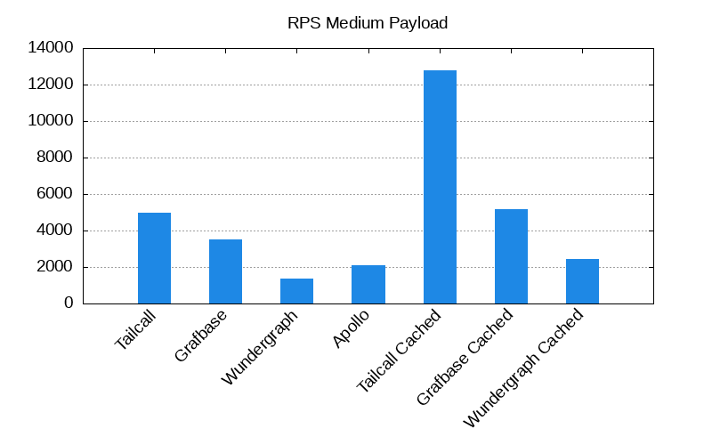
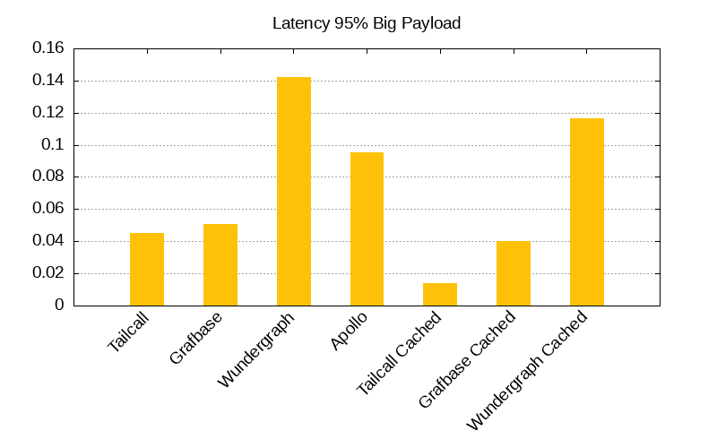

# GraphQL Federation Benchmarks

Explore and compare the performance of the fastest GraphQL federation routers through our comprehensive benchmarks.

- [GraphQL Federation Benchmarks](#graphql-federation-benchmarks)
  - [Benchmark Results](#benchmark-results)
    - [Small Payload - 362 bytes](#small-payload---362-bytes)
    - [Medium Payload - 12,598 bytes](#medium-payload---12598-bytes)
    - [Big Payload - 112,838 bytes](#big-payload---112838-bytes)
    - [RPS Plots](#rps-plots)
    - [Latency 95% Plots](#latency-95-plots)
  - [Architecture](#architecture)
    - [Components](#components)
    - [Specifications](#specifications)
  - [Quick Start](#quick-start)
  - [Resources](#resources)

## Benchmark Results

<!-- PERFORMANCE_RESULTS_START -->
### [Small Payload - 362 bytes](./source/small.json)
| Server | Status | RPS | Latency |
| ---: | ---: | ---: | ---: |
| [Nginx](https://nginx.org/en/) | ✅ | `5,071 RPS` | `0.0197 sec` |
| **Base** | | | |
| [Tailcall](https://github.com/tailcallhq/tailcall) | ✅ | `7,937 RPS` | `0.0122 sec` |
| [Grafbase](https://github.com/grafbase/grafbase) | ✅ | `4,996 RPS` | `0.0145 sec` |
| [Wundegraph](https://github.com/wundergraph/cosmo) | ✅ | `2,661 RPS` | `0.0392 sec` |
| [Apollo](https://github.com/apollographql/router) | ✅ | `2,633 RPS` | `0.0263 sec` |
| **Cached** | | | |
| [Tailcall](https://github.com/tailcallhq/tailcall) | ✅ | `16,470 RPS` | `0.01 sec` |
| [Grafbase](https://github.com/grafbase/grafbase) | ✅ | `6,746 RPS` | `0.0142 sec` |
| [Wundegraph](https://github.com/wundergraph/cosmo) | ✅ | `5,403 RPS` | `0.0227 sec` |
### [Medium Payload - 12,598 bytes](./source/medium.json)
| Server | Status | RPS | Latency |
| ---: | ---: | ---: | ---: |
| [Nginx](https://nginx.org/en/) | ✅ | `4,578 RPS` | `0.0205 sec` |
| **Base** | | | |
| [Tailcall](https://github.com/tailcallhq/tailcall) | ✅ | `4,994 RPS` | `0.0141 sec` |
| [Grafbase](https://github.com/grafbase/grafbase) | ✅ | `3,937 RPS` | `0.0174 sec` |
| [Wundegraph](https://github.com/wundergraph/cosmo) | ✅ | `1,412 RPS` | `0.0697 sec` |
| [Apollo](https://github.com/apollographql/router) | ✅ | `1,780 RPS` | `0.0495 sec` |
| **Cached** | | | |
| [Tailcall](https://github.com/tailcallhq/tailcall) | ✅ | `13,195 RPS` | `0.0073 sec` |
| [Grafbase](https://github.com/grafbase/grafbase) | ✅ | `5,056 RPS` | `0.018 sec` |
| [Wundegraph](https://github.com/wundergraph/cosmo) | ✅ | `2,800 RPS` | `0.0422 sec` |
### [Big Payload - 112,838 bytes](./source/big.json)
| Server | Status | RPS | Latency |
| ---: | ---: | ---: | ---: |
| [Nginx](https://nginx.org/en/) | ✅ | `2,105 RPS` | `0.0395 sec` |
| **Base** | | | |
| [Tailcall](https://github.com/tailcallhq/tailcall) | ✅ | `1,824 RPS` | `0.037 sec` |
| [Grafbase](https://github.com/grafbase/grafbase) | ✅ | `2,024 RPS` | `0.0332 sec` |
| [Wundegraph](https://github.com/wundergraph/cosmo) | ✅ | `778 RPS` | `0.1116 sec` |
| [Apollo](https://github.com/apollographql/router) | ✅ | `1,194 RPS` | `0.0603 sec` |
| **Cached** | | | |
| [Tailcall](https://github.com/tailcallhq/tailcall) | ✅ | `7,636 RPS` | `0.0113 sec` |
| [Grafbase](https://github.com/grafbase/grafbase) | ✅ | `2,467 RPS` | `0.0317 sec` |
| [Wundegraph](https://github.com/wundergraph/cosmo) | ✅ | `983 RPS` | `0.1104 sec` |
<!-- PERFORMANCE_RESULTS_END -->

### RPS Plots





### Latency 95% Plots




## Architecture


### Components

1. `hey`: We use `hey` cli benchmarking tool to cause synthetic load to benchmark the different router `implementations`. We benchmark for '10 seconds`using`200 connections`. We constructed three different request payload configurations: [big](./scripts/bench-hey-big.json), [medium](./scripts/bench-hey-medium.json), [small](./scripts/bench-hey-small.json). Each configuration queries a response of payload size of [112,838 bytes](./source/big.json), [12598 bytes](./source/medium.json), and [362 bytes](./source/small.json) respectively.
2. `Implementations`: We use a collection of different federation implementations, and for each of them, we also have different configuration setups located in the [configurations folder](./configurations/). We benchmark each implementation with varying configurations for every data configuration setup (big, medium, small).
3. `Mock`: This component provides data to the `implementations`. It mocks a GraphQL subgraph and an equivalent Rest API. This component is written in Rust and serves static data. We do that to eliminate any overheads caused by processing the request in a real GraphQL subgraph.

### Specifications

Specifications of the machine used for benchmarking:

```
Platform: Linux x64
Size:
2-cores · 8 GB RAM · 75 GB SSD
```

## Quick Start

1. Clone the repository

   ```bash
   git clone git@github.com:tailcallhq/federation-example.git
   cd federation-example
   ```

2. Ensure you have the latest version of [Docker](https://docs.docker.com/engine/install/)

3. Run the following command:
   ```bash
   docker build -t tailcallhq/federation-benchmark .
   docker run tailcallhq/federation-benchmark:latest ./benchmark_all.sh
   ```
4. Wait for benchmarks to complete.

## Resources

- [Docker](https://www.docker.com/): Docker is a set of platform-as-a-service products that use OS-level virtualization to deliver software in packages called containers.
- [Hey](https://github.com/rakyll/hey): hey is a tiny program that sends some load to a web application.
- [Rust](https://www.rust-lang.org/): Rust is a general-purpose programming language emphasizing performance, type safety, and concurrency. It enforces memory safety, meaning that all references point to valid memory.
- [GraphQL Federation](https://graphql.com/learn/federated-architecture/): GraphQL Federation is an architecture that allows multiple independent GraphQL services to form a unified graph that appears as a single graph to clients. It is a powerful way to scale and manage microservices architecture when using GraphQL.
