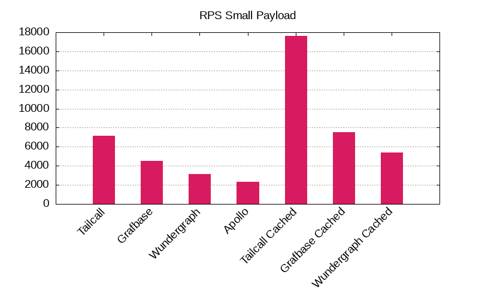

# GraphQL Federation Benchmarks

Explore and compare the performance of the fastest GraphQL federation routers through our comprehensive benchmarks.

- [GraphQL Federation Benchmarks](#graphql-federation-benchmarks)
  - [Benchmark Results](#benchmark-results)
    - [Small Payload - 362 bytes](#small-payload---362-bytes)
    - [Medium Payload - 12,598 bytes](#medium-payload---12598-bytes)
    - [Big Payload - 112,838 bytes](#big-payload---112838-bytes)
    - [RPS Plots](#rps-plots)
    - [Latency 95% Plots](#latency-95-plots)
  - [Architecture](#architecture)
    - [Components](#components)
    - [Specifications](#specifications)
  - [Quick Start](#quick-start)
  - [Resources](#resources)

## Benchmark Results

<!-- PERFORMANCE_RESULTS_START -->
### [Small Payload - 362 bytes](./source/small.json)
| Server | Status | RPS | Latency |
| ---: | ---: | ---: | ---: |
| [Nginx](https://nginx.org/en/) | ✅ | `4,995 RPS` | `0.0209 sec` |
| **Base** | | | |
| [Tailcall](https://github.com/tailcallhq/tailcall) | ✅ | `8,378 RPS` | `0.0101 sec` |
| [Grafbase](https://github.com/grafbase/grafbase) | ✅ | `5,095 RPS` | `0.0134 sec` |
| [Wundegraph](https://github.com/wundergraph/cosmo) | ❌ | `19,041 RPS` | ` sec` |
| [Apollo](https://github.com/apollographql/router) | ✅ | `1,892 RPS` | `0.0428 sec` |
| **Cached** | | | |
| [Tailcall](https://github.com/tailcallhq/tailcall) | ✅ | `18,453 RPS` | `0.0072 sec` |
| [Grafbase](https://github.com/grafbase/grafbase) | ✅ | `6,755 RPS` | `0.0138 sec` |
| [Wundegraph](https://github.com/wundergraph/cosmo) | ❌ | `18,945 RPS` | ` sec` |
### [Medium Payload - 12,598 bytes](./source/medium.json)
| Server | Status | RPS | Latency |
| ---: | ---: | ---: | ---: |
| [Nginx](https://nginx.org/en/) | ✅ | `4,829 RPS` | `0.0195 sec` |
| **Base** | | | |
| [Tailcall](https://github.com/tailcallhq/tailcall) | ✅ | `4,978 RPS` | `0.0138 sec` |
| [Grafbase](https://github.com/grafbase/grafbase) | ✅ | `3,894 RPS` | `0.0177 sec` |
| [Wundegraph](https://github.com/wundergraph/cosmo) | ❌ | `20,046 RPS` | ` sec` |
| [Apollo](https://github.com/apollographql/router) | ✅ | `1,750 RPS` | `0.0488 sec` |
| **Cached** | | | |
| [Tailcall](https://github.com/tailcallhq/tailcall) | ✅ | `12,514 RPS` | `0.008 sec` |
| [Grafbase](https://github.com/grafbase/grafbase) | ✅ | `5,670 RPS` | `0.0143 sec` |
| [Wundegraph](https://github.com/wundergraph/cosmo) | ❌ | `19,174 RPS` | ` sec` |
### [Big Payload - 112,838 bytes](./source/big.json)
| Server | Status | RPS | Latency |
| ---: | ---: | ---: | ---: |
| [Nginx](https://nginx.org/en/) | ✅ | `2,133 RPS` | `0.0346 sec` |
| **Base** | | | |
| [Tailcall](https://github.com/tailcallhq/tailcall) | ✅ | `1,754 RPS` | `0.04 sec` |
| [Grafbase](https://github.com/grafbase/grafbase) | ✅ | `1,749 RPS` | `0.0513 sec` |
| [Wundegraph](https://github.com/wundergraph/cosmo) | ❌ | `19,445 RPS` | ` sec` |
| [Apollo](https://github.com/apollographql/router) | ✅ | `860 RPS` | `0.0964 sec` |
| **Cached** | | | |
| [Tailcall](https://github.com/tailcallhq/tailcall) | ✅ | `7,779 RPS` | `0.0117 sec` |
| [Grafbase](https://github.com/grafbase/grafbase) | ✅ | `2,127 RPS` | `0.0421 sec` |
| [Wundegraph](https://github.com/wundergraph/cosmo) | ❌ | `19,136 RPS` | ` sec` |
<!-- PERFORMANCE_RESULTS_END -->

### RPS Plots




### Latency 95% Plots


## Architecture


### Components

1. `hey`: We use `hey` cli benchmarking tool to cause synthetic load to benchmark the different router `implementations`. We benchmark for '10 seconds`using`200 connections`. We constructed three different request payload configurations: [big](./scripts/bench-hey-big.json), [medium](./scripts/bench-hey-medium.json), [small](./scripts/bench-hey-small.json). Each configuration queries a response of payload size of [112,838 bytes](./source/big.json), [12598 bytes](./source/medium.json), and [362 bytes](./source/small.json) respectively.
2. `Implementations`: We use a collection of different federation implementations, and for each of them, we also have different configuration setups located in the [configurations folder](./configurations/). We benchmark each implementation with varying configurations for every data configuration setup (big, medium, small).
3. `Mock`: This component provides data to the `implementations`. It mocks a GraphQL subgraph and an equivalent Rest API. This component is written in Rust and serves static data. We do that to eliminate any overheads caused by processing the request in a real GraphQL subgraph.

### Specifications

Specifications of the machine used for benchmarking:

```
Platform: Linux x64
Size:
2-cores · 8 GB RAM · 75 GB SSD
```

## Quick Start

1. Clone the repository

   ```bash
   git clone git@github.com:tailcallhq/federation-example.git
   cd federation-example
   ```

2. Ensure you have the latest version of [Docker](https://docs.docker.com/engine/install/)

3. Run the following command:
   ```bash
   docker build -t tailcallhq/federation-benchmark .
   docker run tailcallhq/federation-benchmark:latest ./benchmark_all.sh
   ```
4. Wait for benchmarks to complete.

## Resources

- [Docker](https://www.docker.com/): Docker is a set of platform-as-a-service products that use OS-level virtualization to deliver software in packages called containers.
- [Hey](https://github.com/rakyll/hey): hey is a tiny program that sends some load to a web application.
- [Rust](https://www.rust-lang.org/): Rust is a general-purpose programming language emphasizing performance, type safety, and concurrency. It enforces memory safety, meaning that all references point to valid memory.
- [GraphQL Federation](https://graphql.com/learn/federated-architecture/): GraphQL Federation is an architecture that allows multiple independent GraphQL services to form a unified graph that appears as a single graph to clients. It is a powerful way to scale and manage microservices architecture when using GraphQL.
